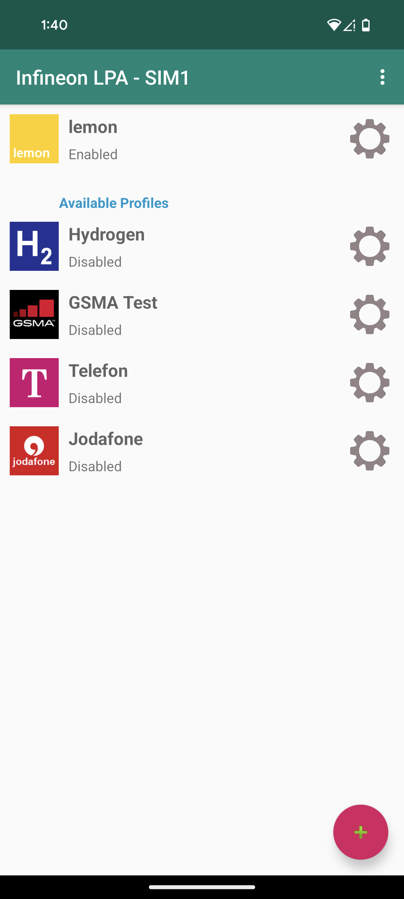
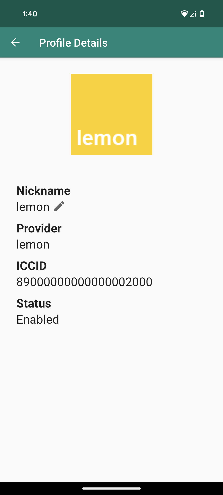
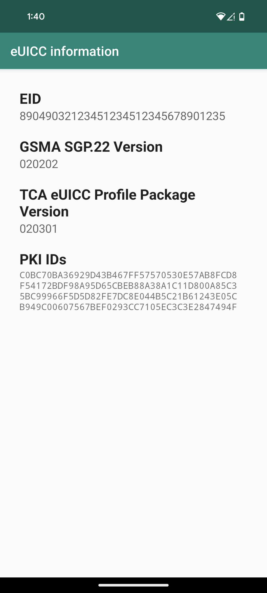

<picture>

</picture>

###

# Infineon Android LPA (Local Profile Assistant)

This is an example implementation of a Local Profile Aassistant according to GSMA SGP.22 for the 
Android 
platform. It shall demonstrate the user experience of an eSIM and serve as example for OEM 
integration.

###

  

## Overview

This software is developed for and tested with the following eUICC:
* [Infineon OPTIGA™ Connect Consumer (OC1120)](https://www.infineon.com/cms/en/product/security-smart-card-solutions/optiga-embedded-security-solutions/optiga-connect/optiga-connect-consumer/)

To test this LPA, please feel free to download a profile from the Infineon Test SM-DP+ profile server:
* [Infineon Test SM-DP+ profile server](https://softwaretools.infineon.com/projects/create/esim)

## Features
This software supports the following features:
* LPA according to GSMA SGP.22
    * Listing of installed profiles
    * Profile download via GSMA Live or GSMA SGP.26 SM-DP+ profile servers
        * Confirmation code handling
    * Switching/Enabling/Disabling of profiles
    * Deleting of profiles
* Support for two reader types:
    * Secure Element Reader: Reads an internal (soldered) or SIM slot inserted eSIM
    * Identiv USB Reader: Reads from an external Identiv USB reader (e.g. Identiv SCR3500)
* Display of eUICC information
    * EID of the eUICC
    * PKI IDs available in the eUICC
    * GSMA SGP.22 version supported by the eUICC
    * TCA eUICC Profile Package version supported by the eUICC

### GSMA SGP.22 Version support

| version     |  support     |
|-------------|--------------|
| 2.0.0-2.5.0 | full support |
| > 3.0.0     | experimental | 

NOTE: Server name extension (v3-specific FQDN) according to GSMAP SGP.22 v3.1 is not supported (yet).

## Implementation information
### Development environment
* Android Studio Hedgehog 2023.1.1

### Project structure
* com.infineon.esim.lpa
    * Android implementation with LPA user interface
* com.infineon.esim.lpa.core
    * Core LPA logic
* com.gsma.sgp.messages
    * Java classes of GSMA SGP.22 messages (ASN1 schema)
* com.infineon.esim.util
    * Utility classes

### Software Dependencies
The Infineon Android LPA is based on the following dependencies:
* Android CCID Library v1.2 for Identiv USB smartcard readers
    * This library serves as an interface between Android platform with USB host support and
      Identiv CCID compliant USB smartcard readers. Android application developers will
      integrate this library as part of their Android application to communicate with Identiv’s
      CCID readers.
    * Automatically downloaded via Gradle task before build
* Other dependencies see in app/build.gradle

### Documentation

Please see the [User Guide](docs/userguide/userguide.md) for more documentation.

## Authors

Michael Spähn (CSS DSI TM AE AEB SW)\
Software Application Engineering\
michael.spaehn@infineon.com

Tan Siow Kiat (SMD I2C3 AP TM CC AEB)\
Systems Application Engineering\
siowkiat.tan@infineon.com

Infineon Technologies AG 